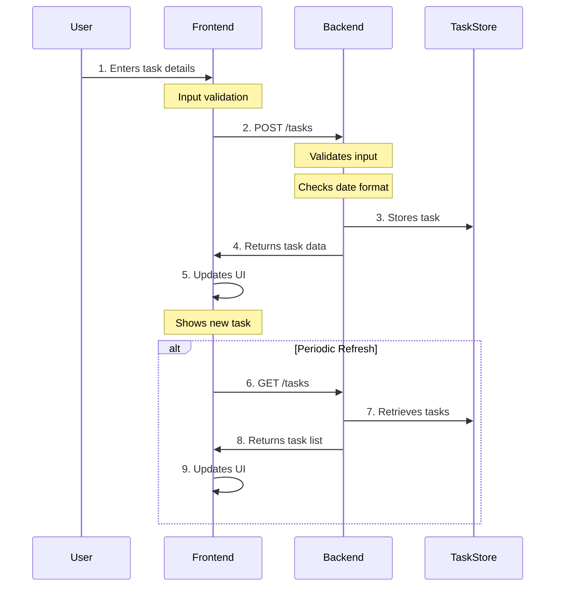
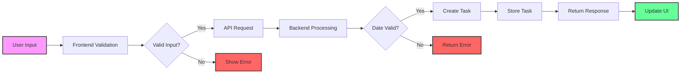

# Task Manager Application

A full-stack task management application with a Node.js/Express backend and a vanilla JavaScript frontend.

## Prerequisites

### Required Software
1. **Node.js**
   - Download from: https://nodejs.org/
   - Required version: v14 or higher
   - Verify installation:
   ```powershell
   node --version
   npm --version
   ```

2. **Visual Studio Code** (Recommended)
   - Download from: https://code.visualstudio.com/
   - Recommended Extensions:
     ```powershell
     code --install-extension GitHub.copilot
     code --install-extension dbaeumer.vscode-eslint
     code --install-extension esbenp.prettier-vscode
     ```

## Project Structure

- [`/backend`](backend/README.md) - Express.js API server
  - Uses Express.js (v5.1.0) and CORS middleware
  - Includes Jest/Supertest for API testing
  - ESLint for code quality
- [`/frontend`](frontend/README.md) - Vanilla JavaScript frontend application
  - Simple static file server setup
  - Modern JavaScript features
  - Clean, responsive UI

## Getting Started

1. Clone the repository:
```powershell
git clone https://github.com/TL-Consulting-Lab/task_manager_Demo.git
cd task_manager_Demo
```

2. Set up and start the backend:
```powershell
cd backend
npm install
npm run dev
```
The backend will run on http://localhost:4000

3. Set up and start the frontend (in a new terminal):
```powershell
cd frontend
npm install
npm run dev
```
The frontend will run on http://localhost:3000 (or another available port if 3000 is in use)

## Development

### Running Tests
```powershell
cd backend
npm test
```

### Verification Steps
1. Backend API: Open http://localhost:4000/tasks in browser
2. Frontend UI: Open http://localhost:3000 (or assigned port)
3. Try creating, updating, and deleting tasks

### Troubleshooting

1. **Port Conflicts**
   - Frontend: Will automatically use next available port if 3000 is occupied
   - Backend: Modify port in backend/index.js if 4000 is unavailable

2. **Dependencies Issues**
   ```powershell
   rm -r node_modules
   npm cache clean --force
   npm install
   ```

## Additional Resources

- [Backend Documentation](backend/README.md) - API endpoints and testing
- [Frontend Documentation](frontend/README.md) - UI components and features
- [Express.js Documentation](https://expressjs.com/)
- [Jest Documentation](https://jestjs.io/)

## Workflow Diagrams

### Task Creation and Display Flow



### Task Data Flow



## Data Flow Details

1. **User Input Stage**
   - User enters task title
   - Optional: category selection
   - Optional: due date (DD-MM-YYYY)

2. **Frontend Validation**
   - Checks for required title
   - Validates date format
   - Sanitizes input

3. **API Request**
   - Sends POST request to `/tasks`
   - Includes task data in JSON format

4. **Backend Processing**
   - Validates input data
   - Checks date format and validity
   - Generates task ID
   - Sets default values
   - Calculates overdue status

5. **Response Handling**
   - Success: Updates UI with new task
   - Error: Displays error message

6. **Display Updates**
   - Adds task to list
   - Updates task count
   - Shows success message
   - Clears input form